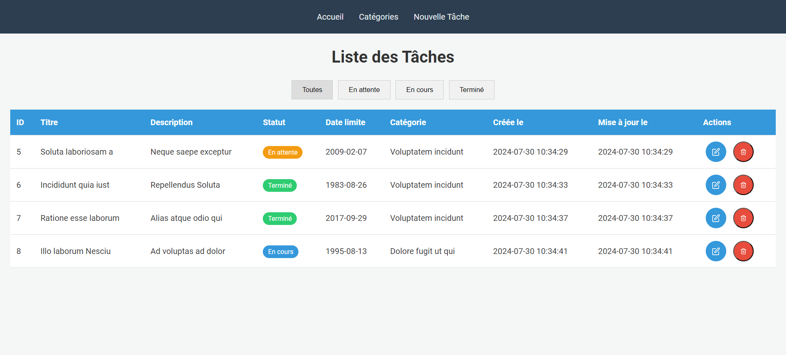
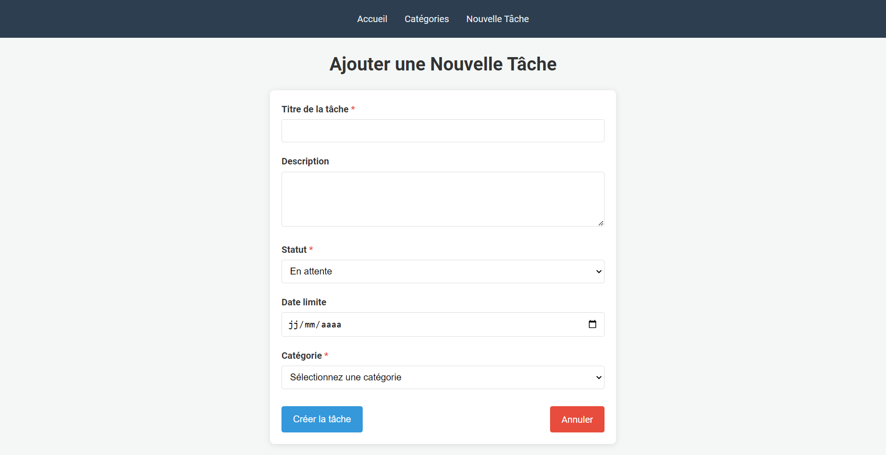
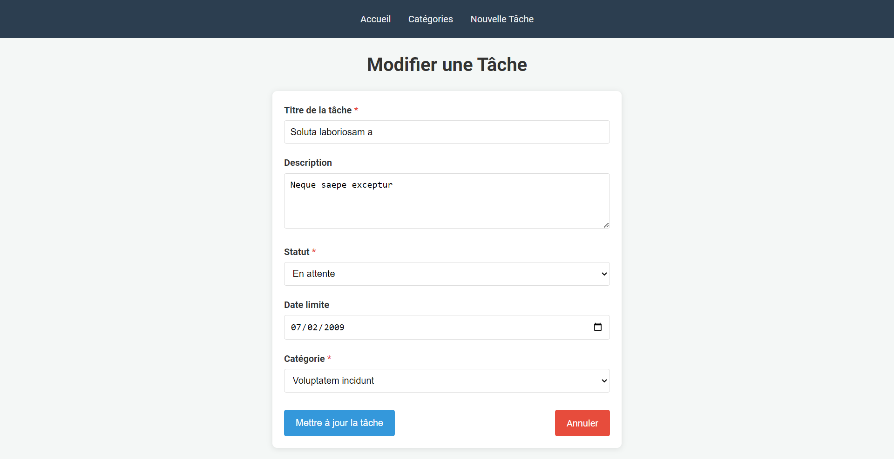
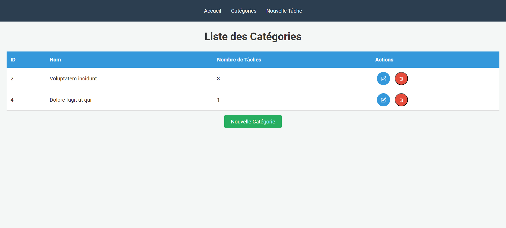
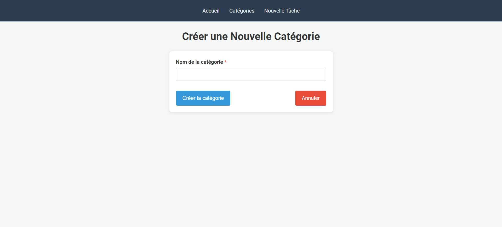
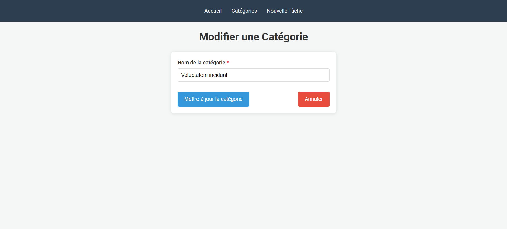

# Application de Gestion de Tâches

## Description du Projet

Cette application de gestion de tâches permet de créer, lire, mettre à jour et supprimer des tâches ainsi que des catégories. Les utilisateurs peuvent assigner des catégories aux tâches et filtrer les tâches par catégorie et par statut.

## Fonctionnalités

- **CRUD des tâches** : Créer, lire, mettre à jour et supprimer des tâches.
- **CRUD des catégories** : Créer, lire, mettre à jour et supprimer des catégories.
- **Assignation de catégories** : Assigner une catégorie à chaque tâche.
- **Filtrage des tâches** : Afficher la liste des tâches avec possibilité de filtrer par catégorie et par statut.
- **Validation des données** : Assurer que les données entrées par l'utilisateur sont valides.
- **Relations Eloquent** : Utilisation des relations Eloquent entre les modèles `Task` et `Category`.

## Technologies Utilisées

- **Laravel** : Framework PHP pour le développement de l'application.
- **Blade** : Moteur de templates de Laravel pour les vues.
## Installation

1. Clonez le dépôt sur votre machine locale :
    ```bash
    git clone https://github.com/Immac20/gestion_de_taches.git
    ```

2. Accédez au répertoire du projet :
    ```bash
    cd REPOSITORY
    ```

3. Installez les dépendances :
    ```bash
    composer install
    ```

4. Créez un fichier `.env` à partir du fichier `.env.example` et configurez vos paramètres de base de données :
    ```bash
    cp .env.example .env
    ```

5. Générez la clé d'application :
    ```bash
    php artisan key:generate
    ```

6. Exécutez les migrations pour créer les tables nécessaires dans la base de données :
    ```bash
    php artisan migrate
    ```

7. Démarrez le serveur de développement :
    ```bash
    php artisan serve
    ```

## Interface Utilisateur

Voici les captures d'écran des interfaces de l'application :

- **Liste des tâches** : 
- **Ajouter une tâche** : 
- **Modifier une tâche** : 
- **Liste des catégories** : 
- **Ajouter une catégorie** : 
- **Modifier une Catégorie** : 

